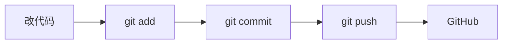

# 10 · 美化 GitHub 主页 + Markdown 进阶

> 这一章教你两件让人眼前一亮的事：① 给自己的 GitHub 主页加一段**个人介绍卡片**（很多人不知道能这么玩）；② 把 Markdown 从"会写标题"升级到"会做表格、徽章、折叠、流程图"。
> 全程都有**可直接复制**的例子。

---

## 一、隐藏彩蛋：给你的 GitHub 主页加"个人名片"

你访问别人主页时，有时会看到顶部一大段精美的自我介绍、技能徽章、统计图——那不是 GitHub 自带的，是对方用一个**特殊仓库**做出来的。你也能做：

> 🔑 **魔法规则：建一个仓库，名字正好等于你的 GitHub 用户名，里面的 `README.md` 会自动显示在你的主页顶部。**

### 三步搞定

1. 点 **➕ → New repository**。
2. **Repository name** 填成**和你用户名一模一样**的（比如用户名 `lixiaoming` 就填 `lixiaoming`）。
   - 填对的瞬间，GitHub 会弹出一行提示：**"✨ You found a secret! ... this special repository ... will appear on your profile"**（你发现了一个彩蛋）。看到这句就对了。
3. 勾选 **Public** + **Add a README file**，创建。然后编辑这个 `README.md`。

### 可直接抄的"个人名片"模板

把下面这段粘进那个 README，改成你自己的：

```markdown
## 👋 你好，我是李小明

🎓 正在学习编程 ｜ 📍 中国 ｜ ☕ 喜欢折腾有趣的小项目

- 🌱 我正在学：**Git / GitHub、HTML、Python**
- 🔭 我在做：用 GitHub 管理我的学习笔记
- 📫 联系我：lixiaoming@example.com
- ⚡ 一个冷知识：我的第一个仓库是用来存菜谱的 🍳

### 🛠️ 技能


```

保存后回到你的主页 `github.com/你的用户名`，这段就显示在最上面了 🎉。

---

## 二、徽章（Badge）：那些彩色小标签怎么来的

上面 `` 那种彩色小标签叫**徽章**，来自一个免费网站 **shields.io**。格式：

```

```

例子：

```markdown


```

- 颜色可填英文（`blue`/`green`/`red`）或十六进制（`2563eb`）。
- 想要带图标的（如上面的 Git 图标），加 `?logo=git`，图标名去 shields.io 或 simpleicons.org 查。

> 💡 还有人放"GitHub 统计卡片"（显示你的提交数、常用语言），那是第三方项目 **github-readme-stats** 生成的，搜它的名字能看到用法。属于锦上添花，了解即可。

---

## 三、Markdown 进阶语法大全（带效果说明）

第 3 章学了标题、加粗、列表、链接。这里把**专业文档/README 常用**的进阶语法补齐，每个都能直接抄。

### 1. 代码块 + 语法高亮

用三个反引号包起来，**在开头标上语言名**，GitHub 会自动上色：

````markdown
```python
def hello(name):
    print(f"你好, {name}")
```
````

效果就是带颜色高亮的代码框。常用语言名：`python`、`javascript`、`html`、`bash`、`json`、`sql` 等。

### 2. 表格（还能对齐）

```markdown
| 左对齐 | 居中 | 右对齐 |
| :--- | :---: | ---: |
| 苹果 | 3 | ￥12 |
| 香蕉 | 12 | ￥6 |
```

`:` 的位置决定对齐方向：左、两边、右。

### 3. 任务清单（可勾选的方框）

```markdown
- [x] 注册 GitHub 账号
- [x] 建第一个仓库
- [ ] 提交第一个 PR
- [ ] 搭好个人网站
```

在 Issue 和 PR 里，这些方框**能直接点击打勾**，常用来追踪进度。

### 4. 提示框（GitHub 专属，很好看）

```markdown
> [!NOTE]
> 普通提示信息。

> [!TIP]
> 小技巧。

> [!IMPORTANT]
> 重要内容，别错过。

> [!WARNING]
> 警告，小心操作。

> [!CAUTION]
> 高危，三思而后行。
```

GitHub 会把它们渲染成**带颜色和图标**的醒目框，比普通引用显眼得多。

### 5. 折叠块（点开才展开，省空间）

```markdown
<details>
<summary>👉 点我看答案</summary>

这里是被折叠的内容，默认收起，点上面那行才展开。
可以放很长的内容、代码、图片。

</details>
```

常用来藏"答案""详细日志""可选步骤"，让文档清爽。

### 6. 图片（控制大小用 HTML）

```markdown
普通插入：

要控制尺寸就用 HTML：

```

### 7. 流程图 / 图表（Mermaid）

GitHub 支持用文字画图，代码块语言写 `mermaid`：

````markdown

````

GitHub 会把它**渲染成真正的流程图**，画架构、流程、思维导图都行，不用截图。

### 8. 其它常用零碎

```markdown
分割线：用三个减号
---

折行/换行：行末敲两个空格再回车，或空一行另起段落

引用：
> 这是一段引用
>> 这是嵌套引用

行内代码：用反引号包 `git status`

表情：直接打 :tada: :rocket: :+1:  （GitHub 会变成 🎉 🚀 👍）
```

---

## 四、把这些用起来：升级你的项目 README

一个让人愿意点 Star 的项目 README，通常长这样（结构可抄）：

```markdown
# 项目名 + 一句话简介

![徽章们...]

## ✨ 功能特点
- [x] 已完成的功能
- [ ] 计划中的功能

## 🚀 快速开始
（用代码块写安装/运行步骤）

## 📷 截图


## 🤝 如何贡献
（链接到第 6 章那种 Fork→PR 流程）

## 📄 License
MIT
```

> 🔑 **好 README 是项目的脸面**。访客 10 秒内能看懂"这是啥、怎么用、好不好"，才愿意留下。把上面的语法组合起来用，你的项目立刻专业一个档次。

---

## ✅ 本章自测 / 练习

1. 怎样让一段自我介绍显示在你的 GitHub 主页顶部？仓库要起什么名字？
2. **动手做**：用本章模板做一张自己的"个人名片"，至少包含 3 个徽章和一个技能列表。
3. 在某个仓库的 README 里，用上：一个带语法高亮的代码块、一个三列表格、一个任务清单、一个 `> [!TIP]` 提示框、一个 `<details>` 折叠块。
4. 用 Mermaid 画一张"从 clone 到 push"的流程图。

> 主页变好看了，进入 [11-在VS Code里用Git](./11-在VS-Code里用Git.md)，学会用图形界面代替命令行做日常操作。
